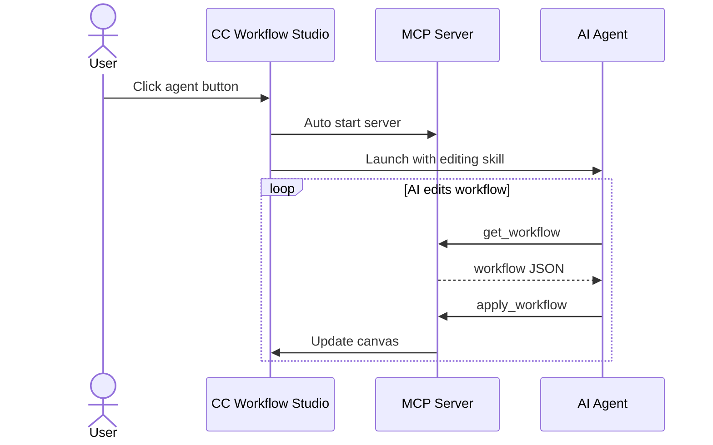

# CLAUDE.md

This file provides guidance to Claude Code (claude.ai/code) when working with code in this repository.

## Project Overview

CC Workflow Studio is a **VSCode extension** for visually building AI agent workflows. Users create workflows on a React Flow canvas, then export/run them across multiple AI agents (Claude Code, GitHub Copilot, Roo Code, Cursor, Gemini, Codex, etc.). Workflows are stored as JSON in `.vscode/workflows/`.

**Tech stack**: TypeScript 5.3, React 19, React Flow 11, Zustand 5, Radix UI, Vite 7, Biome 2.4

## Build & Development Commands

```bash
npm run format          # Auto-format with Biome
npm run lint            # Lint check
npm run check           # All Biome checks (lint + format verification)
npm run build           # Full build (generates schemas → builds webview → builds extension)
npm run build:dev       # Dev build without minification
npm run watch           # Extension watch mode
npm run watch:webview   # Webview dev server
npm run test            # All tests
npm run test:unit       # Webview unit tests (Vitest)
npm run test:e2e        # End-to-end tests (WebdriverIO)
```

**Before every commit**: `npm run format && npm run lint && npm run check`

**Before E2E testing**: `npm run build` then launch VSCode Extension Development Host

## Architecture

This is a two-process VSCode extension:

```
Extension Host (Node.js)          Webview (React in iframe)
─────────────────────────         ──────────────────────────
src/extension/                    src/webview/
  extension.ts  ← entry point      main.tsx  ← entry point
  commands/     ← message handlers  App.tsx   ← 3-column layout
  services/     ← business logic    stores/   ← Zustand state
  utils/        ← validation, etc.  components/ ← UI components
  editors/      ← custom editors    services/ ← vscode-bridge.ts
  i18n/         ← translations      hooks/    ← React hooks

src/shared/types/  ← shared between both processes
  workflow-definition.ts  ← core data model (NodeType, Workflow, etc.)
  messages.ts             ← all message type contracts
  mcp-node.ts             ← MCP-specific types
```

### Extension ↔ Webview Communication

All communication uses **bidirectional `postMessage`** with typed message envelopes:

- **Webview → Extension**: `vscode-bridge.ts` wraps `vscode.postMessage()` with Promise-based request/response via `requestId`
- **Extension → Webview**: Command handlers call `webview.postMessage()` directly
- **Message contracts**: All types defined in `src/shared/types/messages.ts`

### State Management

- **Extension Host**: Stateless, event-driven via VSCode commands and message handlers
- **Webview**: `workflow-store.ts` (Zustand) manages canvas state — nodes, edges, selection, workflow metadata

### MCP Integration

A built-in MCP server (`McpServerManager`) runs on localhost with HTTP transport. External AI agents use `get_workflow`/`apply_workflow` tools to read and edit the canvas. DNS rebinding protection is enforced via Host/Origin header validation.

### Multi-Agent Export

Each AI agent has dedicated export services in `src/extension/services/`. Workflows are converted to agent-specific formats (Markdown skills, JSON configs, CLI commands).

## Key Files

| File | Purpose |
|------|---------|
| `src/shared/types/workflow-definition.ts` | Core data model — `NodeType`, `Workflow`, `WorkflowNode`, node data interfaces |
| `src/shared/types/messages.ts` | All Extension ↔ Webview message type contracts (~60KB) |
| `src/extension/extension.ts` | Extension entry point — activation, command registration, MCP init |
| `src/webview/src/App.tsx` | Root component — Node Palette \| Canvas \| Property Panel |
| `src/webview/src/stores/workflow-store.ts` | Main Zustand store for canvas state |
| `src/webview/src/services/vscode-bridge.ts` | Webview → Extension communication bridge |
| `src/webview/src/components/PropertyOverlay.tsx` | Node property editor (large file) |
| `src/extension/services/mcp-server-service.ts` | Built-in MCP server implementation |
| `src/extension/services/export-service.ts` | Multi-agent workflow export orchestration |

## Code Style (Biome)

- Single quotes, always semicolons, ES5 trailing commas
- 2-space indent, 100-char line width
- Auto-organize imports enabled

## Commit Message Guidelines

**Keep commit messages simple for squash merge workflow.**

```
<type>: <subject>      ← 50 chars max, imperative mood, no period

- bullet point 1       ← 3-5 bullet points max, "what" changed only
- bullet point 2       ← put "why" and "how" in PR description
```

Types: `feat:` (minor bump), `fix:` (patch), `improvement:` (patch), `docs:`, `refactor:`, `chore:` (no release)

## Release Process

Fully automated via **Semantic Release** on push to `production` branch. Do NOT manually update version numbers. The pipeline handles `package.json`, `src/webview/package.json`, `src/webview/package-lock.json`, and `CHANGELOG.md`.

## AI Editing Features

### MCP Server-based AI Editing (Active)
The built-in MCP server (`cc-workflow-ai-editor` skill) is the primary interface for external AI agents to create and edit workflows. All new AI editing development should go through MCP.



### Chat UI-based AI Editing (Discontinued)
The chat UI features (Refinement Chat Panel, AI Workflow Generation Dialog) are **no longer under active development**. Existing functionality is maintained only.

## Dialog Component Guidelines

**All dialogs must use `@radix-ui/react-dialog`.**

### z-index Hierarchy (3 layers)

| z-index | Layer | Examples |
|---------|-------|---------|
| **9999** | Standalone/parent dialogs | McpNodeDialog, SkillBrowserDialog, SlackShareDialog, SubAgentFlowDialog |
| **10000** | Nested child dialogs | SkillCreationDialog, SlackManualTokenDialog, TermsOfUseDialog |
| **10001** | Confirmation dialogs | ConfirmDialog |

### Dialog Template

```tsx
import * as Dialog from '@radix-ui/react-dialog';

const Z_INDEX = {
  DIALOG_BASE: 9999,
  DIALOG_NESTED: 10000,
  DIALOG_CONFIRM: 10001,
} as const;

export function MyDialog({ isOpen, onClose }: Props) {
  return (
    <Dialog.Root open={isOpen} onOpenChange={(open) => !open && onClose()}>
      <Dialog.Portal>
        <Dialog.Overlay
          style={{
            position: 'fixed',
            inset: 0,
            backgroundColor: 'rgba(0, 0, 0, 0.5)',
            display: 'flex',
            alignItems: 'center',
            justifyContent: 'center',
            zIndex: Z_INDEX.DIALOG_BASE,
          }}
        >
          <Dialog.Content>{/* content */}</Dialog.Content>
        </Dialog.Overlay>
      </Dialog.Portal>
    </Dialog.Root>
  );
}
```
